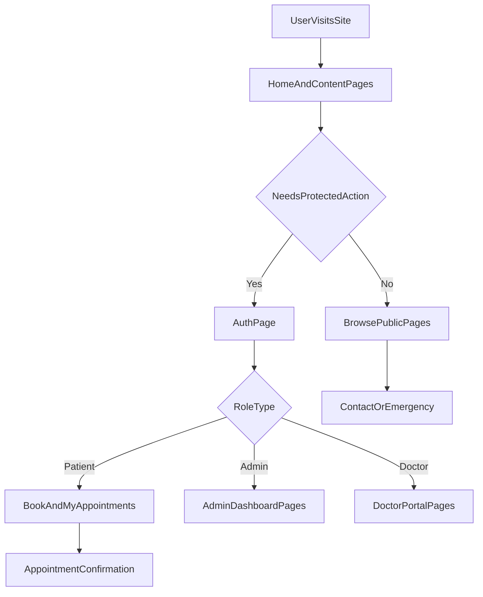
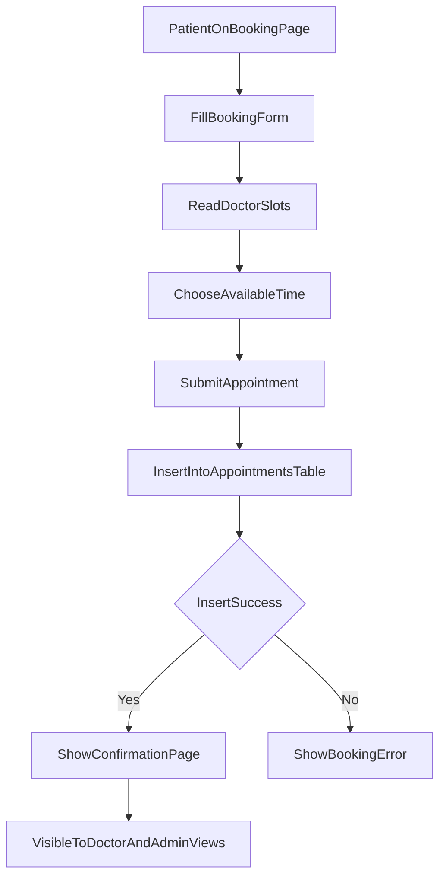
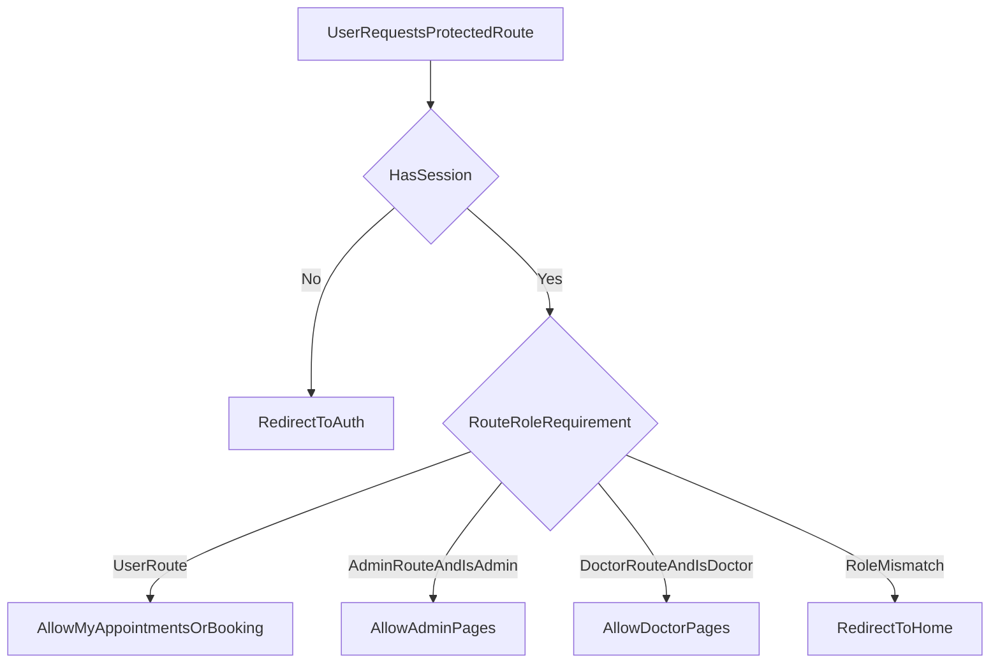
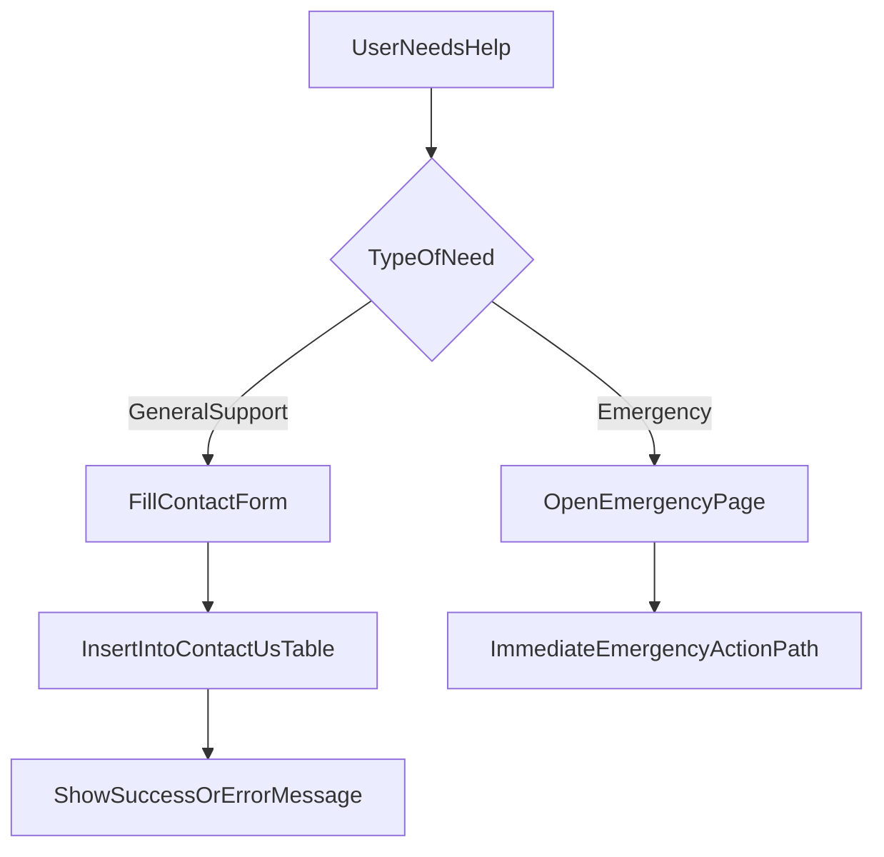

# Full Project Analysis Handoff

## 1) Project Snapshot

This project is a healthcare web application for a clinic. It helps patients discover services, book appointments, contact the clinic, and handle online consultation workflows. It also has role-based dashboards for admin and doctors.

- Frontend: React + React Router
- Backend/API layer: Supabase (Auth, Database, Edge Functions)
- Main architecture style: SPA frontend calling Supabase directly from UI
- Access model: public pages + protected user pages + admin-only pages + doctor-only pages

Main routing and page wiring: [c:\Users\Fawaz\Desktop\web2\src\App.jsx](c:\Users\Fawaz\Desktop\web2\src\App.jsx)

---

## 2) Pages and Routes Inventory

### Route count

From router config, there are **32 defined routes**:
- 22 public or general routes
- 1 auth route
- 1 protected user route
- 3 admin routes
- 5 doctor routes

### Page component count

There are **31 page components** under `src/pages` (including doctor sub-pages).  
The extra difference is because home is available on both `/` and `/home`.

### Full route list with purpose

#### Public / General routes

1. `/` -> `HealthcareHome`
   - Main landing page with hero, services highlights, reviews, FAQ, and booking CTA.
2. `/home` -> `HealthcareHome`
   - Same as `/`; alternate home route.
3. `/about` -> `About`
   - Clinic intro, trust building, doctors, achievements, and CTA.
4. `/doctor/rizwan-shafiq` -> `DoctorRizwan`
   - Doctor profile, qualifications, timings, and booking entry.
5. `/doctor/faiza-malik` -> `DoctorFaiza`
   - Doctor profile, qualifications, timings, and booking entry.
6. `/services` -> `Services`
   - Service/departments overview and pathways to booking.
7. `/locations` -> `Locations`
   - Clinic location details (Lahore/Kasur style info) and local service context.
8. `/online-consultation` -> `OnlineConsultation`
   - Explains online consult process, platform options, and how to book.
9. `/home-visit` -> `HomeVisit`
   - Home visit info, availability conditions, and booking CTA.
10. `/contact` -> `Contact`
   - Contact details + contact form that submits to Supabase.
11. `/blog` -> `Blog`
   - Blog listing/search/filter style content page.
12. `/blog/:slug` -> `BlogPost`
   - Single post details by slug.
13. `/gallery` -> `Gallery`
   - Clinic/gallery media page.
14. `/faq` -> `FAQ`
   - Frequently asked questions.
15. `/privacy-policy` -> `PrivacyPolicy`
   - Privacy/legal information.
16. `/terms` -> `Terms`
   - Terms and conditions/legal information.
17. `/payment/return` -> `PaymentReturn`
   - Return page after payment gateway flow (or placeholder return state).
18. `/payment/booking` -> `PaymentPlaceholder`
   - Payment booking placeholder flow.
19. `/appointment/confirmation` -> `AppointmentConfirmation`
   - Booking confirmation display, often after successful insert.
20. `/emergency` -> `Emergency`
   - Emergency request flow with quick action support.
21. `/book-appointment` -> `BookAppointment` (protected)
   - Standard appointment booking page using shared booking form.
22. `/book-appointment/smart` -> `SmartBookAppointment` (protected)
   - Enhanced/step-driven booking experience.

#### Auth route

23. `/auth` -> `AuthPage`
   - Sign in, sign up, and account recovery entry point.

#### Protected user route

24. `/my-appointments` -> `MyAppointments` (protected)
   - Logged-in patient view of personal appointments.

#### Admin-only routes

25. `/admin/appointments` -> `AdminAppointments`
   - Admin management for appointments (review/update/status actions).
26. `/admin/doctors` -> `AdminDoctors`
   - Admin management for doctor profiles/schedules/slot controls.
27. `/admin/patients` -> `AdminPatients`
   - Admin patient view and related appointment overview.

#### Doctor-only routes

28. `/doctor` -> `DoctorDashboard` (index in doctor layout)
   - Doctor dashboard overview.
29. `/doctor/appointments` -> `DoctorAppointments`
   - Doctor list of assigned appointments.
30. `/doctor/consultations` -> `DoctorConsultations`
   - Doctor online consultations management view.
31. `/doctor/consultation/:id` -> `DoctorConsultationRoom`
   - Single live consultation room/workflow.
32. `/doctor/schedule` -> `DoctorSchedule`
   - Doctor slot and availability schedule management.

Protected routing logic: [c:\Users\Fawaz\Desktop\web2\src\components\Auth\ProtectedRoute.jsx](c:\Users\Fawaz\Desktop\web2\src\components\Auth\ProtectedRoute.jsx)

---

## 3) Major Functionality (Core Business Flow)

## A) Authentication and role access

- User session is handled via Supabase Auth in [c:\Users\Fawaz\Desktop\web2\src\contexts\AuthContext.jsx](c:\Users\Fawaz\Desktop\web2\src\contexts\AuthContext.jsx).
- On login/session restore, app fetches:
  - `profiles` for user profile data
  - `user_roles` for role list
- App derives role flags:
  - `isAdmin`
  - `isDoctor`
- Route protection behavior:
  - If not logged in -> redirect to `/auth`
  - If logged in but wrong role for admin/doctor route -> redirect to `/`

## B) Appointment booking lifecycle

Main booking flow is implemented in [c:\Users\Fawaz\Desktop\web2\src\components\Shared\BookingForm.jsx](c:\Users\Fawaz\Desktop\web2\src\components\Shared\BookingForm.jsx):

1. User fills appointment form.
2. Form validates required fields.
3. Doctor slots are fetched from `doctor_slots`.
4. Date + slot logic computes selectable times.
5. On submit, app inserts row into `appointments`.
6. On success, user navigates to `/appointment/confirmation` with key info in query params.

Important business rules visible in code:
- Home visit restricted by city selection logic.
- Online consultation asks for preferred platform.
- Doctor-specific day/slot availability is enforced from slot table.

## C) Contact flow

Implemented in [c:\Users\Fawaz\Desktop\web2\src\pages\Contact.jsx](c:\Users\Fawaz\Desktop\web2\src\pages\Contact.jsx):

1. User fills contact form.
2. App sends insert to `contact-us` table.
3. User sees success or error message.

Contact table migration: [c:\Users\Fawaz\Desktop\web2\supabase\migrations\0002_create_contact_us.sql](c:\Users\Fawaz\Desktop\web2\supabase\migrations\0002_create_contact_us.sql)

## D) Admin operations

Admin pages allow operational control:
- Appointment oversight and updates
- Doctor-related management (including schedule/slot area)
- Patient overview and linked appointment context

These are guarded by `adminOnly` route checks in router/protected route.

## E) Doctor operations

Doctor pages support:
- Dashboard overview
- Appointment list handling
- Online consultation list + room entry
- Meeting link/status workflow in consultation room
- Doctor schedule management

Doctor routes are protected with `doctorOnly`.

---

## 4) Minor / Supporting Functionality

- Blog pages for content marketing and SEO support (`/blog`, `/blog/:slug`)
- Gallery page for trust/social proof (`/gallery`)
- FAQ page for common issue deflection (`/faq`)
- Legal pages for compliance (`/privacy-policy`, `/terms`)
- Emergency quick-access page (`/emergency`)
- Payment placeholder/return pages for payment path continuity
- Shared layout/navigation/footer guiding users into booking flow

---

## 5) Data Layer and Integrations

## Confirmed migration-managed schema

### `appointments` table (altered)
Migration adds invite-tracking fields:
- `invites_last_link`
- `invites_sent_at`

File: [c:\Users\Fawaz\Desktop\web2\supabase\migrations\0001_add_invites_tracking.sql](c:\Users\Fawaz\Desktop\web2\supabase\migrations\0001_add_invites_tracking.sql)

### `contact-us` table (created)
Fields:
- `id`, `name`, `email`, `phone`, `subject`, `message`, `created_at`

File: [c:\Users\Fawaz\Desktop\web2\supabase\migrations\0002_create_contact_us.sql](c:\Users\Fawaz\Desktop\web2\supabase\migrations\0002_create_contact_us.sql)

## Additional SQL setup scripts (root-level)

The repo also includes broader SQL scripts (likely run manually in Supabase SQL editor) for things like:
- appointments model expansion
- auth profile/roles
- doctor slots
- payments

These scripts are useful context, but the two migration files above are the explicit versioned migration source in `supabase/migrations`.

## Edge Function integration (meeting invites)

Edge function: [c:\Users\Fawaz\Desktop\web2\supabase\functions\send-meeting-invites\index.ts](c:\Users\Fawaz\Desktop\web2\supabase\functions\send-meeting-invites\index.ts)

What it does:
1. Receives `POST` payload with `appointmentId` and optional `meetingLink`.
2. Fetches appointment using service-role Supabase client.
3. Resolves final meeting link.
4. Sends email through either:
   - custom webhook (`EMAIL_WEBHOOK_URL`) or
   - Resend (`RESEND_API_KEY`, `RESEND_FROM_EMAIL`)
5. Avoids duplicate invite sends for same link.
6. Updates invite tracking fields in `appointments`.

## Frontend -> backend interaction summary

- Auth flows: Supabase Auth API (`signIn`, `signUp`, `signOut`, reset/update password)
- Booking: UI inserts into `appointments`
- Slot availability: UI reads `doctor_slots`
- Contact: UI inserts into `contact-us`
- Role access: UI reads `profiles` and `user_roles`

---

## 6) End-to-End Flow Diagrams

### A) Overall site flow

### B) Appointment data flow

### C) Role-based access flow

### D) Contact and emergency flow

---

## 7) Implementation Status Notes (Honest Handoff)

## Fully working/implemented areas

- Multi-page frontend with route-level access control
- Authentication and role detection from Supabase
- Booking form with doctor slot availability and Supabase insert
- Contact form with Supabase insert
- Admin and doctor route groups with guarded access
- Edge function for online consultation invite sending

## Partial/placeholder or evolving areas

- Payment flow has placeholder pages and return page, but appears not fully end-to-end integrated with a live gateway in current code.
- Some broad product scope in docs is larger than currently wired UI flow.
- Root-level SQL setup scripts suggest expanded schema/features; not all of that is clearly migration-managed in `supabase/migrations`.

---

## 8) Short Handoff Script (Easy Words)

You can use this directly when explaining your project:

“This is a healthcare clinic web app built with React and Supabase.  
It has public pages for services, doctors, locations, blog, FAQ, legal pages, and contact.  
Main core feature is appointment booking. Users log in, choose doctor/date/time from available slots, and submit booking. That booking is saved in Supabase and user gets a confirmation page.  
There is role-based access: normal users can see their appointments, admins can manage appointments/doctors/patients, and doctors can manage their own appointments, consultations, and schedules.  
Contact form data is also saved in Supabase. For online consultation, there is an Edge Function that can send meeting invite emails and track when invites are sent.  
In total, router currently has 32 routes and 31 page components. The project is functional for core clinic workflows, with some advanced flows like full payment integration still in progress.”

---

## 9) Quick Reference: Key Files

- Router: [c:\Users\Fawaz\Desktop\web2\src\App.jsx](c:\Users\Fawaz\Desktop\web2\src\App.jsx)
- Auth context: [c:\Users\Fawaz\Desktop\web2\src\contexts\AuthContext.jsx](c:\Users\Fawaz\Desktop\web2\src\contexts\AuthContext.jsx)
- Route guard: [c:\Users\Fawaz\Desktop\web2\src\components\Auth\ProtectedRoute.jsx](c:\Users\Fawaz\Desktop\web2\src\components\Auth\ProtectedRoute.jsx)
- Booking form core: [c:\Users\Fawaz\Desktop\web2\src\components\Shared\BookingForm.jsx](c:\Users\Fawaz\Desktop\web2\src\components\Shared\BookingForm.jsx)
- Contact page flow: [c:\Users\Fawaz\Desktop\web2\src\pages\Contact.jsx](c:\Users\Fawaz\Desktop\web2\src\pages\Contact.jsx)
- Invite edge function: [c:\Users\Fawaz\Desktop\web2\supabase\functions\send-meeting-invites\index.ts](c:\Users\Fawaz\Desktop\web2\supabase\functions\send-meeting-invites\index.ts)
- Migrations: [c:\Users\Fawaz\Desktop\web2\supabase\migrations\0001_add_invites_tracking.sql](c:\Users\Fawaz\Desktop\web2\supabase\migrations\0001_add_invites_tracking.sql), [c:\Users\Fawaz\Desktop\web2\supabase\migrations\0002_create_contact_us.sql](c:\Users\Fawaz\Desktop\web2\supabase\migrations\0002_create_contact_us.sql)
